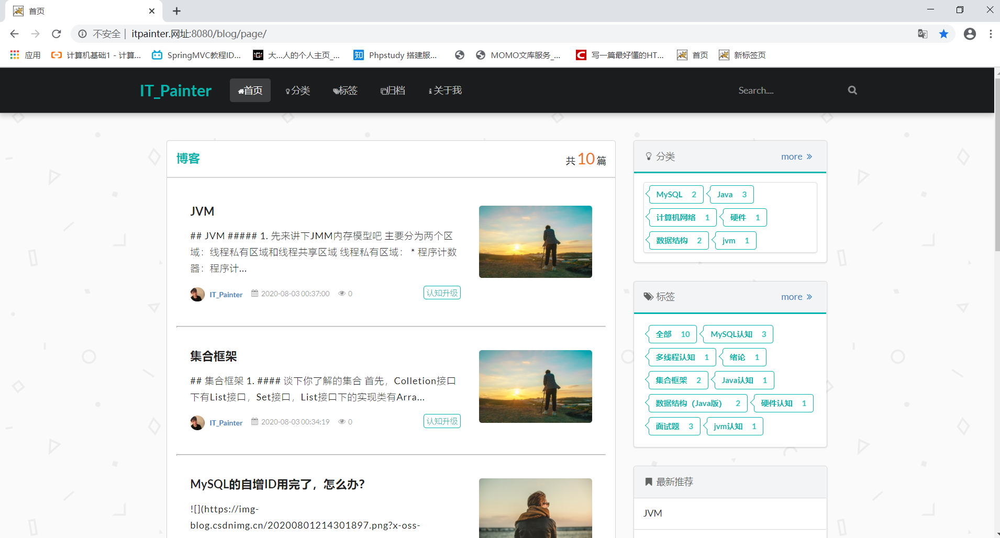
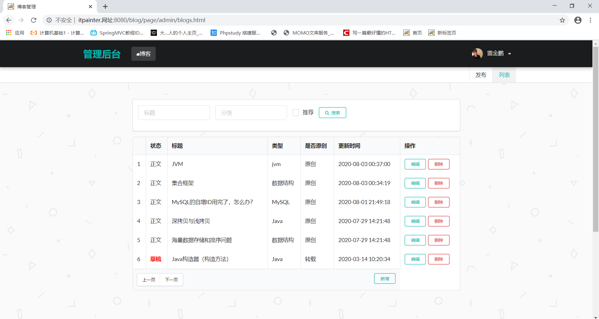

# MyBlog
我的个人博客，前端是在网上找的小而美，自己再改了下

演示地址：[ http://itpainter.xn--ses554g:8080/blog/page/ ](http://itpainter.xn--ses554g:8080/blog/page/)
开发环境：浏览器+IDEA+jdk1.8              
技术栈：  Servlet（前端控制器）+Fiter（过滤器）+Mysql（数据库）+Driuid（数据库连接池）+jackson（序列化	工具）+Ajax（交互方式）+semantic UI框架（css框架）
项目需求：
1. 登录：通过Md5加密判断登录状态、并通过fiter判断用户是否登录成功而访问管理界面
2. 分页查询，模糊查询：采用异步的方式，而且主要是用了Sql语句来控制该返回的数据
3. 博客数据的增删查改：博客类的常见需求，主要也是用Sql语句占大头
4. 文件下载：指定response的响应头返回输出流
> 遇见问题：中文文件问题（下载时弹出框不能识别中文名）
> 解决方式：获取客户端使用的浏览器版本信息，并根据不同的版本信息，设置filename的编码方式不同

分页查询，模糊查询

